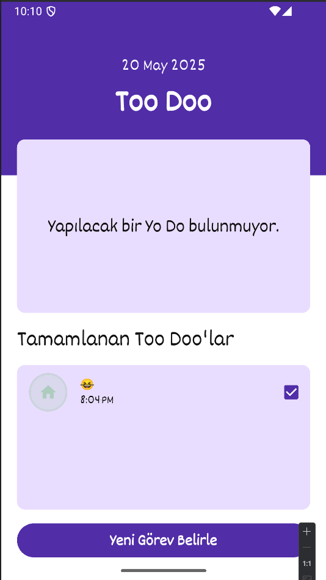
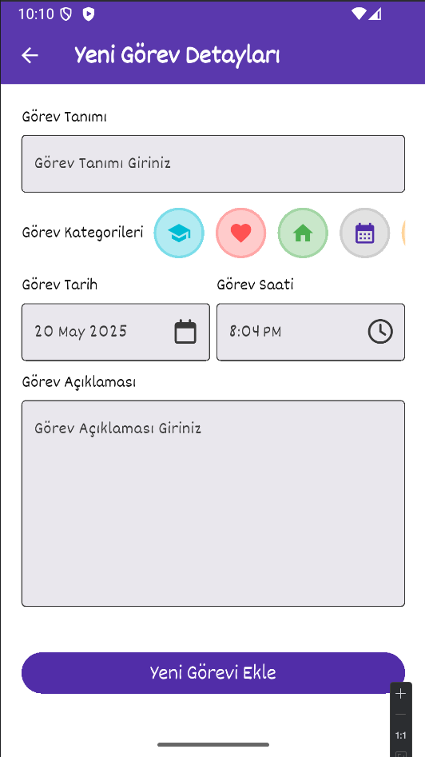

# To Do Uygulaması 📝

Yapılacak görevlerinizi, işlemlerinizi, ayı yerden yönetmek ve bir plan çerçevesine sokmak için geliştirmiş bir mobil uygulama.

## 📷 Ekran Görüntüleri
Ana Ekran:



Yeni Görev Oluşturma Ekranı:



## ⚙️ Kurulum
1. Bu repoyu klonlamak için:
  ```bash
    https://github.com/EnsAkyl/flutter-todo-app.git
  ```
2. Gerekli bağımlılıkları yükleyin: **npm install**
3. Uygulamayı Başlatın: **npm start**

## 📦 Teknolojiler
    - RivedPod
    - Equatable
    - Go 
    - SQLFLite
    - Path
    - Intl

